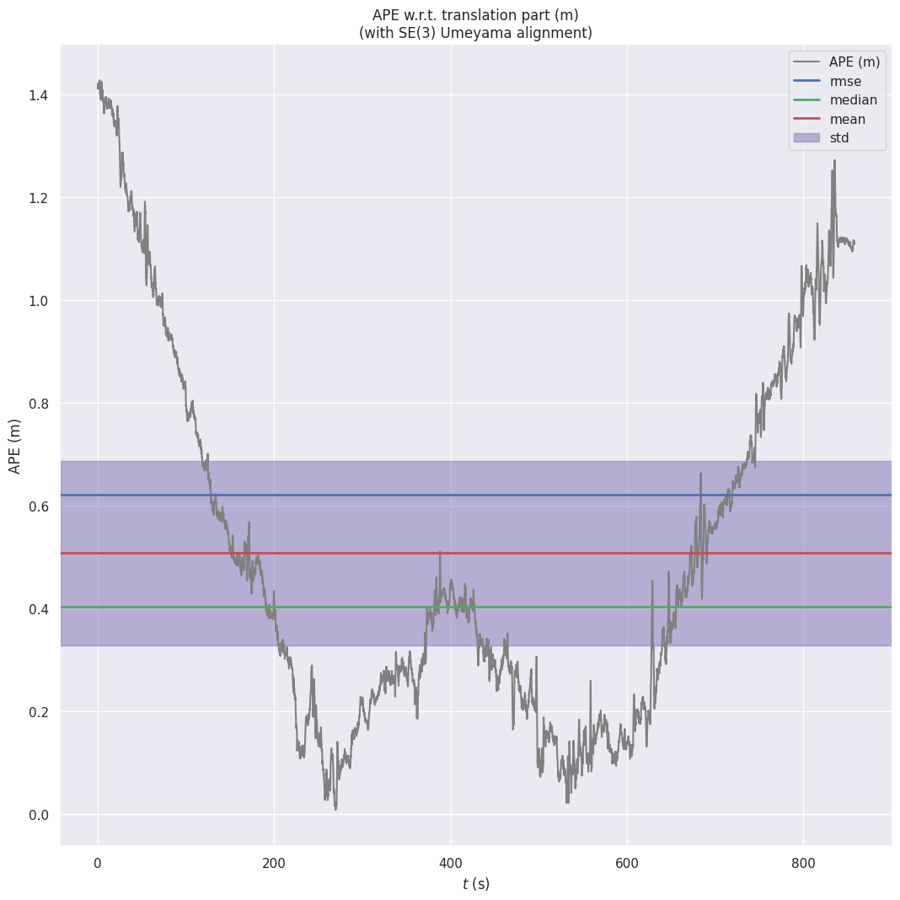
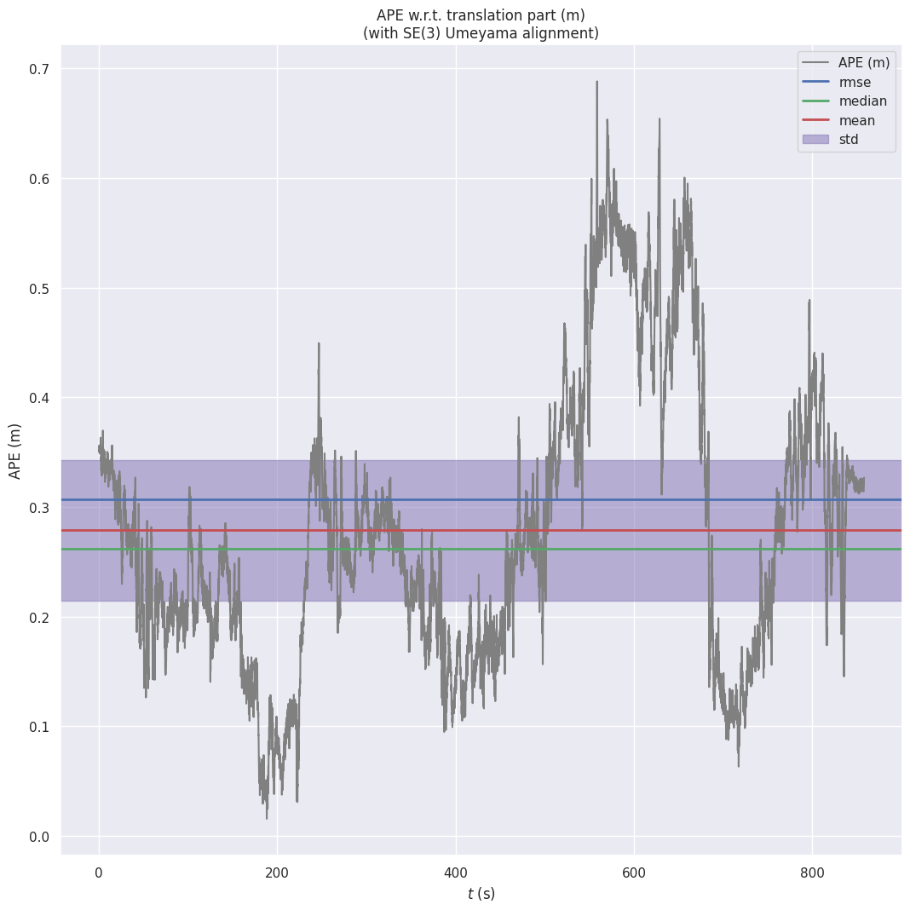
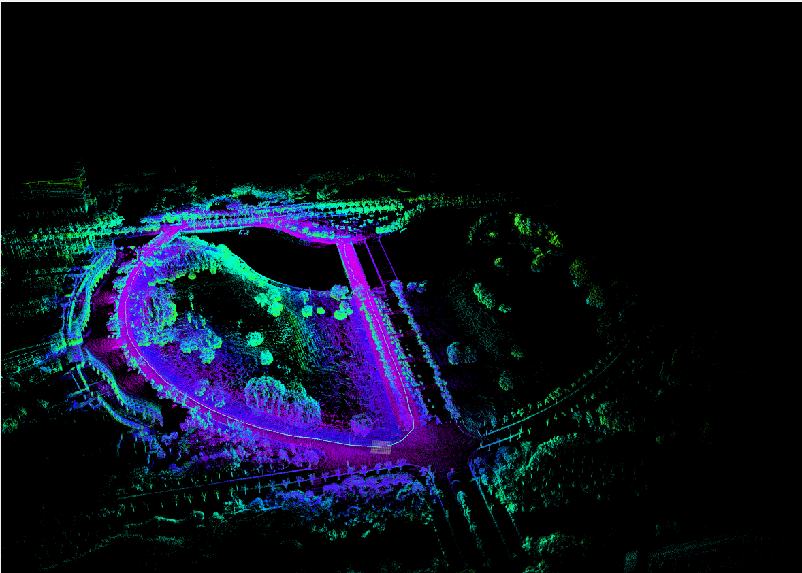
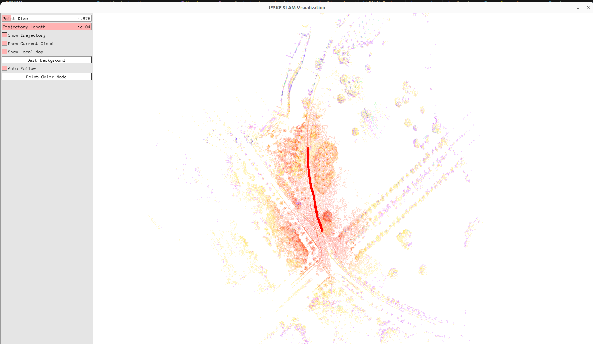

## Personal learning toy, similar to Fast-LIO2, based on the eigen library to implement the laser inertial odometry of the Iterated Right-Invariant Kalman Filter  and the Iterated Error State Kalman Filter (under development)

## Bad coding skill, think twice before using this project（代码写得一陀，想用需三思）
## Comparison Result :
Faster lio on m2dgr street 04

I-RIKF on m2dgr street 04

map

pangolin

## TODO

* [X] Add time_unit adaption for velodyne
* [X] Add trajectory and map save
* [X] Implement the iterated version of Right Invariant Kalman Filter
* [X] Add Pangolin,rid of stupid rviz (rviz still optinal though)
* [ ] Add gravity for invkf state (probably not doing this!)
* [X] Add IKdtree to improve realtime performance (still some code cleaning workd to do, but that is for the future self)
* [X] Add loop clousre to improve global consitency (in branch dev/loop)
* [ ] Add extrinsic estimation (probably not doing this also!)

## Acknowledgments
 A big thanks to 
https://github.com/mengkai98/ieskf_slam for his detailed tutorial and excellent code，this project is built based on his work